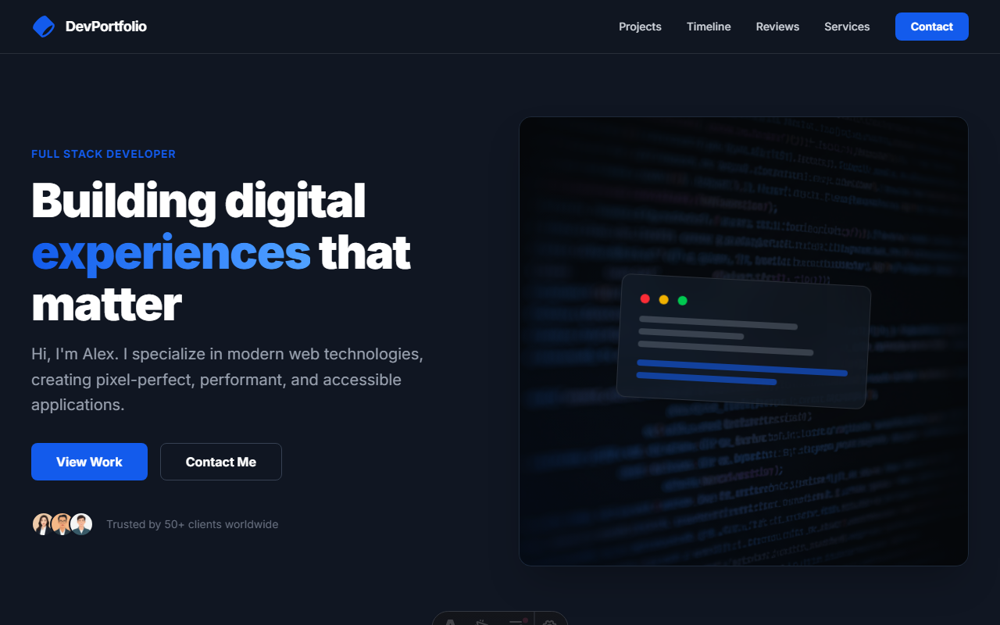

<p align="center">
  
</p>

<div align="center">
  
  
  
  
</div>

<br />

<div align="center">
  <h1>🚀 Professional Developer Portfolio</h1>
  <p><strong>A Modern, High-Performance Showcase built with Astro 5 & Real-time GitHub Integration</strong></p>
  <p><i>Featuring the "Nano Banana" design system for a unique, high-tech identity.</i></p>
</div>

---

## 💻 Project Overview

This repository represents a state-of-the-art developer portfolio designed for performance, SEO, and visual excellence. It moves beyond static templates by dynamically fetching project data directly from the **GitHub REST API**, ensuring the showcase is always in sync with the latest code developments.

Built on **Astro 5.0**, the project leverages **Static Site Generation (SSG)** with optimized dynamic routing, delivering instantaneous load times and a premium user experience.

## 🛠️ Technical Architecture

### 🛡️ Core Engine
- **Astro 5**: Utilizing the latest features including the `ClientRouter` and `Image` optimization components.
- **Dynamic Routing**: Implementation of `[slug].astro` with `getStaticPaths` for pre-rendering repository-specific detail pages.
- **GitHub Service Layer**: A custom TypeScript service providing typed interfaces for repository metadata fetching and filtering.

### 🎨 Design & Experience
- **View Transitions**: Implementing **Shared Element Transitions** between the project listing and detail pages for seamless, app-like navigation.
- **Tailwind CSS**: A custom design system focusing on dark-mode aesthetics, sophisticated typography, and motion-blur overlays.
- **Responsive Architecture**: Fluid layouts that maintain visual integrity across mobile, tablet, and ultra-wide desktops.

## 🌟 Key Features

- **Automated Project Sync**: Non-forked repositories are automatically pulled and categorized.
- **Shared Element Transitions**: The "Hero Transition" ensures visual continuity for project names and images across views.
- **SEO Optimized**: Semantic HTML5 structure, dynamic Meta tags for each project, and structured data readiness.
- **Optimized Assets**: Automatic image format conversion and resizing using Astro's built-in middleware.

## 🚀 Installation & Deployment

### Prerequisites
- Node.js 18+ 
- pnpm (recommended) or npm

### Setup
1. **Clone the project**
   ```bash
   git clone https://github.com/devlitus/porfolio-gemini.git
   cd porfolio-gemini
   ```

2. **Install Dependencies**
   ```bash
   pnpm install
   ```

3. **Development Mode**
   ```bash
   pnpm dev
   ```

4. **Production Build**
   ```bash
   pnpm build
   ```

## 📂 Project Structure

```text
/
├── src/
│   ├── components/       # Reusable UI modules (Header, Footer, Projects)
│   │   └── project/      # Specific components for the Detail View
│   ├── layouts/          # Base HTML wrappers with View Transitions
│   ├── pages/            # File-based routing (Index, Dynamic Project Slugs)
│   ├── services/         # API integration logic (GitHub API)
│   └── styles/           # Global design tokens and Tailwind config
├── public/               # Static assets
└── astro.config.mjs      # Framework configuration
```

---

<div align="center">
  <p>Developed with a focus on clean code and visual impact.</p>
  <p><strong>Built with ❤️ by [devlitus](https://github.com/devlitus)</strong></p>
</div>
